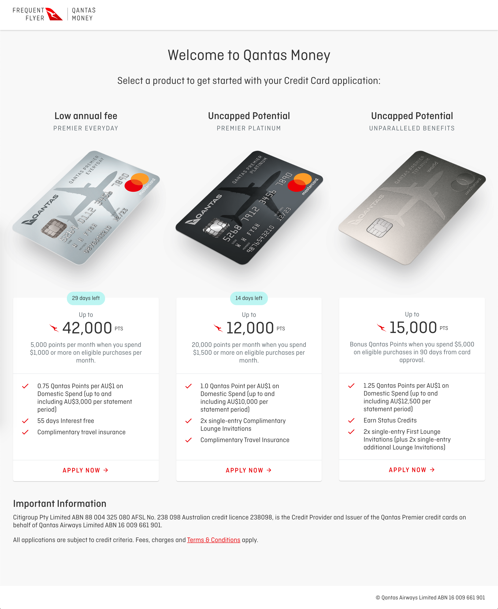
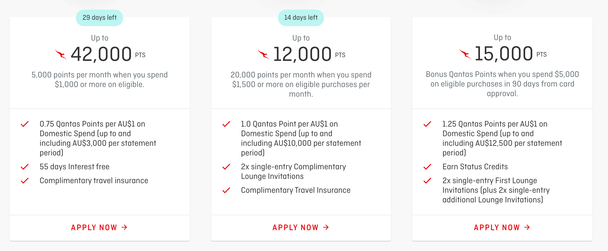
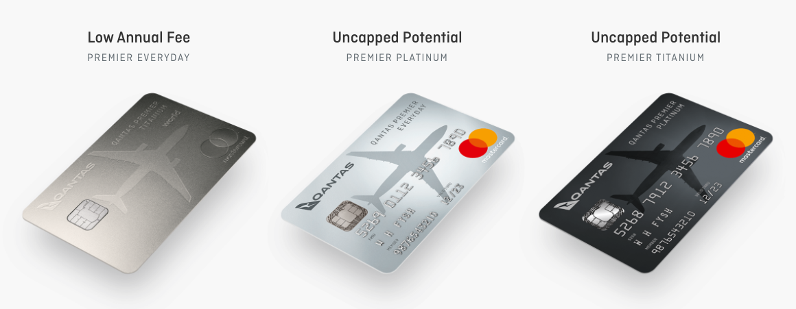
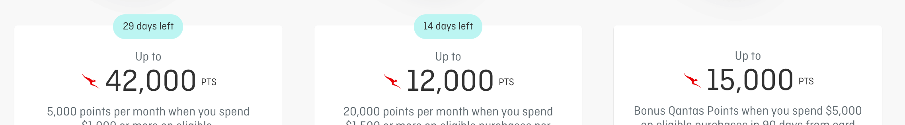
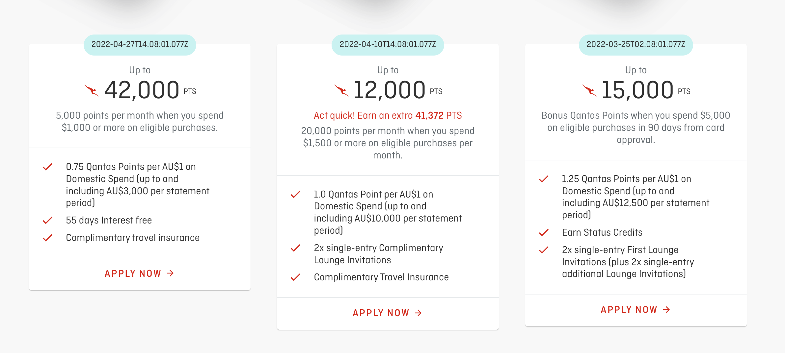
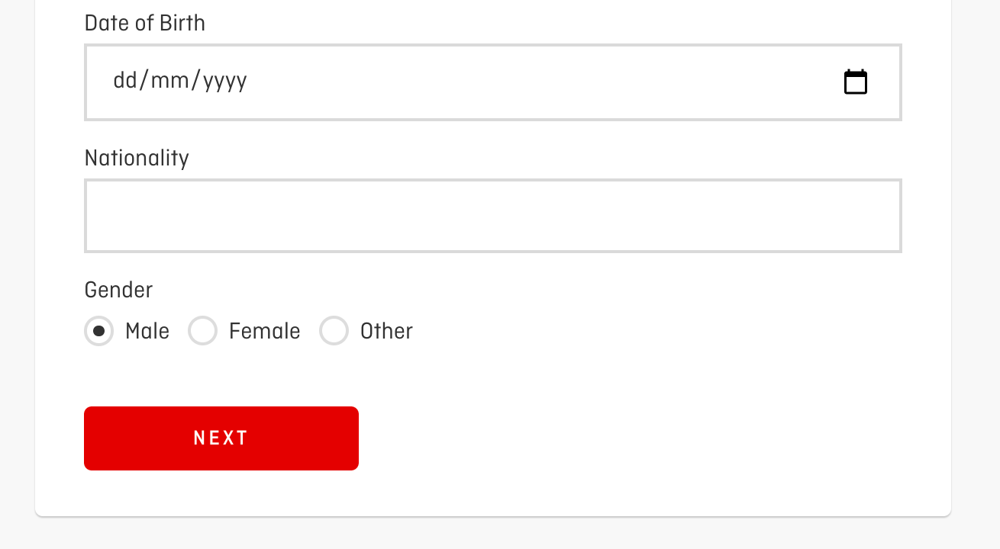
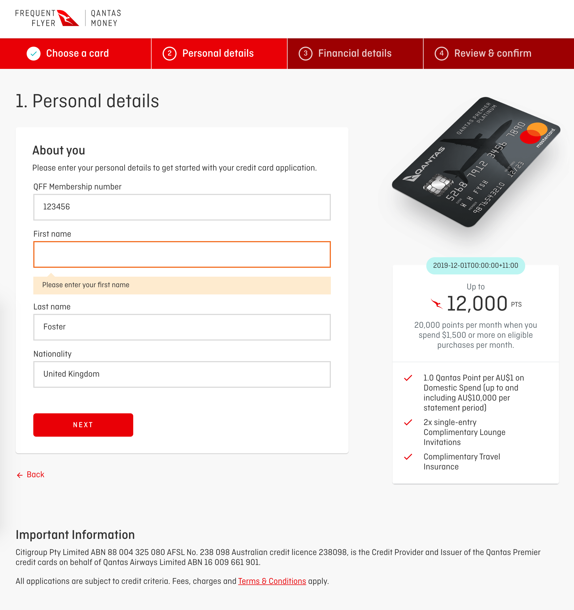

# Qantas Loyalty Frontend Developer Technical Assessment

Hello! We are excited that you are taking this technical assessment and look forward to reviewing your solutions to each of the challenges.

Before starting, you'll need an understanding of:

- React 16.8+
- TypeScript / JavaScript
- GraphQL
- Apollo client and server
- CSS modules

If this isn't you, stop here and speak to your Qantas contact or recruiter.

Please follow the instructions in this readme carefully, we ask that you work on the solution by yourself and submit only your own code for each of the tasks.

Good luck and have fun!

---

## Table of contents

- [1. Getting started](#1-getting-started)
- [2. Browse the app](#2-browse-the-app)
- [3. Technical tasks](#3-technical-tasks)
- [4. Submission](#4-submission)

---

<br>

## 1. Getting started

### 1.1 Create a new public git repo

Login to your Github account and create a new repo named `qantas-loyalty-technical-assessment`. Unzip our starting files into a new folder and from this folder run the following:

```
$ git init
$ git remote add origin git@github.com:REPLACE_WITH_YOUR_USERNAME/qantas-loyalty-technical-assessment.git
$ git add .
$ git commit -m "Adding Qantas Loyalty technical assessment base files"
$ git push -u origin master
```

_❗️**Important**: Please keep this repo public._

### 1.2. Add local environment variables

```
$ npm run init:env
```

### 1.3. Install apps locally:

You'll need node `14.19.1` and `npm` installed. Then run:

```
$ nvm install # to install and use 14.19.1 specified in the .nvmrc
$ npm run install-all
```

### 1.4. Start apps locally:

```
$ npm start
```

This will start development servers for:

- React SPA - [http://localhost:3000](http://localhost:3000)
- GraphQL server - [http://localhost:4000](http://localhost:4000)
- Node JS Express Mock API - [http://localhost:5000](http://localhost:5000) (A basic mock of our API's)

### 1.5. Run unit tests:

```
$ npm test
```

---

<br>

## 2. Browse the app

Visit [http://localhost:3000](http://localhost:3000) in your browser. You should see a homepage similar to:



It's a simplified application form for customers to apply for a Qantas credit card products.

Complete an application for any credit card. We want you to familiarise yourself with the app and to ensure that it is functional end to end on your local machine before you start with the tasks.

_💡**Tip**: If you experience any JS errors or problems at this point, raise them with your Qantas contact or recruiter before continuing!_

---

<br>

## 3. Technical tasks

For each task we ask that create a branch from your `master` with the task name. E.g:

```
$ git branch <task-31_css-bug-task>
```

You can complete as many of the tasks as you like but most people attempt 2-3 tasks and please try to spend spent no more than 3 hours in total.

_❗️**Important**: Raise one PR for each task. Include a brief summary in the Pull Request description so we can understand your approach and thinking. If you are not able or don't have time to complete a task to production quality, we will be expecting the PR description to highlight what is missing._

- [Task 3.1 - Bug hunt](#task-31---bug-hunt)
- [Task 3.2 - CSS bug](#task-32---css-bug)
- [Task 3.3 - Capitalise util](#task-33---capitalise-util)
- [Task 3.4 - Hook challenge](#task-34---hook-challenge)
- [Task 3.5 - Days remaining](#task-35---days-remaining)
- [Task 3.6 - Offer countdown points](#task-36---offer-countdown-points)
- [Task 3.7 - Radio buttons](#task-37---radio-buttons)
- [Task 3.8 - Multi credit card applications](#task-310---multi-credit-card-applications)
- [Task 3.9 - Validation](#task-312---validation)

---

### Task 3.1 - Bug hunt
<details>
  <summary>Background task</summary>
  <br>

  **Acceptance Criteria**

  - Fix any bugs anywhere in the code. The bugs can be in GraphQl, React, Typescript or CSS.
  - Apply the fix in whatever task branch you're working on at the time.
  - Where possible, add unit tests to prove the bugs are fixed.
  - No need to raise a dedicated PR for the bugs.
  - No need to fix the same bug more than once across multiple tasks' PRs.

  _💡**Tip**: Check the bugs you find aren't already tasks in this assessment_ <br>
</details>

---

### Task 3.2 - CSS bug
<details>
  <summary>⏱: 10-15 minutes (small)</summary>
  <br>

  As a customer, I want the "Apply now" button, credit card features and description to be horizontally aligned so it's easy to visually compare credit cards on the homepage.

  **Acceptance Criteria**

  On the homepage credit card selector:

  - Each of the credit card features should be horizontally aligned.
  - Each of the apply now buttons should be at aligned to the bottom of the card.
  - The height of the credit card title, description and features should be variable to accommodate any amount of copy.

  **Design**
  
</details>

---

### Task 3.3 - Capitalise util
<details>
  <summary>⏱: 10-15 minutes (small)</summary>
  <br>

  As a customer, I want to see the titles of the visible products with capitalised words.

  **Acceptance Criteria**

  - Write a JS function that capitalises the first letter of all words in a string (we know this can be done with CSS but we prefer JS for this exercise).
  - Use this function on the product title.
  - E.g. the data coming through for the first title is "Low annual fee", but it will display "Low Annual Fee"
  - Extra points for tests!

  **UI Design**

  
</details>

---

### Task 3.4 - Hook challenge
<details>
  <summary>⏱: 10-15 minutes (small)</summary>
  <br>

  As a developer, I want to make use of a hook to make the dev experience better in some way

  **Acceptance Criteria**

  - Refactor any part of the frontend to make use of a custom react hook.
</details>

---

### Task 3.5 - Days remaining
<details>
  <summary>⏱: 30-60 minutes (medium)</summary>
  <br>

  As a customer, I want to see the number of days remaining for a credit card offer so I know if an offer is about to expire.

  **Acceptance Criteria**

  Look in [creditCards.ts](./mock-api/src/data/creditCards/creditCards.ts), this is a mock response from the creditCards API. Each credit card has a `expiryDate` UTC dateTime.

  - Add a countdown of days remaining from the users current dateTime until `expiryDate`.
  - If days remaining is greater than 60 don't show a countdown.

  Copy should read:

  - "X days left" when more than one day
  - "X day left" when one day remains
  - "X hours left" when less than one day
  - "Expired" if the `expiryDate` when less than zero days

  Add unit tests to cover all acceptance criteria.

  **Design**
  

  _💡**Tip**: You can edit the `expiryDate` for each credit card in the mock data if the date is in the past. Think carefully about where in the project is the best place to implement this logic._
</details>

---

### Task 3.6 - Offer countdown points
<details>
  <summary>⏱: 30-60 minutes (medium)</summary>
  <br>

  As a customer, I want to see the points of a countdown offer, counting down to the expiry date.

  **Acceptance Criteria**

  - Uncomment the already styled countDownOffer div in the Card.tsx component
  - For an offer with `countDownOfferPoints` and `countDownOfferExpiryDate` defined, it should count down (one point every second).
    - 43,200...43,199...43,198
  - Here's a few scenarios for the offer with `countDownOfferPoints` as 43,200. If user loads the page at...
    - 50,000 seconds before `countDownOfferExpiryDate`, do not show the countdown offer text.
    - 43,200 seconds before `countDownOfferExpiryDate`, show the countdown ticking down from 43,200...43,199...
    - 1,000 seconds before `countDownOfferExpiryDate`, show the countdown ticking down from 1,000..999...
    - 10 seconds after `countDownOfferExpiryDate`, do not show the countdown offer text.
  - Refreshing the page, will not reset the countdown, it will always be based on `countDownOfferExpiryDate`.

  **UI Design**

  
</details>

---

### Task 3.7 - Radio buttons
<details>
  <summary>⏱: 30-60 minutes (medium)</summary>
  <br>

  As a customer, I want to specify my gender using radio buttons

  **Acceptance Criteria**

  - Make a new component called RadioButtons to be used for specifying gender on the 'About You' page of the application.
  - Style the radio buttons your self without importing a library.
  - Try to get them as close to the design as possible.

  **UI Design**

  
</details>

---

### Task 3.8 - Multi credit card applications
<details>
  <summary>⏱: 1-2 hour (large)</summary>
  <br>

  As a customer, I want to start and resume applications for multiple credit cards at the same time.

  **Example Scenario**

  Customer John starts a credit card application for Everyday, he gets half way through the application journey and realises that the card credit limit doesn't meet his requirements so he switches to the Platinum card. At that point he should be taken to the first step in the application journey with no fields repopulated from the previous application.

  **Background**

  Each credit card application has a unique url E.g. `/{creditCardCode}/personal-details` using `creditCardCode` as a parameter.

  When a customer starts an application we persisted their data to apollo client cache but it is not unique for each credit card code, it is incorrectly shared.

  **Acceptance Criteria**

  - Each credit card application should be unique.
  - Do not persist data across different credit card applications.
  - Generate a new `applicationId` for each credit card application.
</details>

---

### Task 3.9 - Validation
<details>
  <summary>⏱: 2 hours (large)</summary>
  <br>

  As a product owner, I want validation on all forms so that customer data is in a format we expect.

  **Acceptance Criteria**

  - Add form validation to the GraphQL server for one of the step mutations.
  - Validation errors should be shown inline, in the UI on form submit.
  - Use the following [personal details JSON schema](./assets/3.12.task-personal-details.json).
  - Use the following [financial details JSON schema](./assets/3.12.task-financial-details.json).

  **UI Design**

  
</details>

---

<br>

## 4. Submission

Now let your Qantas contact or recruiter know you have finished the assessment. They will communicate the next steps to you.

If you have any feedback on the assessment we'd love to hear your thoughts!

Thank you,

From the Qantas Loyalty development team.
